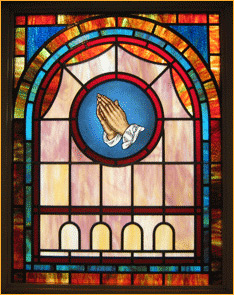

	

<!--END COL-LEFT-->
	

		<h1>About Our Company</h1>
	    
When we began our ministry years ago, we wanted to represent only higher quality manufacturers to insure our customers have products that are not only cosmetically appealing, but that stand the test of time. Working with different builders, architects and churches throughout the southeast is a vital part of our plans and future goals. We will be happy to work with your builder or interior designer to accomplish your interior color desires. We quite simply want to offer the utmost in quality products and services at prices that will allow church committees to know that they have been good stewards and have made wise use of their resources.

	    
We at Sanders Church Furnishings are proud of our manufacturers and their quality. {{ site.time | date:"%Y" | minus:1994 | date:"%Y" }} years in this business has taught us to represent only higher quality manufacturers. I will say the quality of our products is the highest in our industry and our warranties the strongest. Again, we appreciate this opportunity to introduce our higher quality products and I know once you review our products and our competitive pricing you will be pleased. All of our products carry a warranty (pews, chairs, stained glass, upholstering, and furniture).

	    
Working with you is a vital part of our plans and future goals. We would like to be part of yours by providing the very best quality products at competitive prices. If you need additional literature would like to see other samples, we will be most happy to meet with you and the church. We know once you see our quality, you will agree as to the value and quality of our complete line of products and service. Call and tell us what other information we can send or to establish a time and date to come. We can bring samples for you to see. There is, of course, no commitment required for our coming. I look forward to hearing from you.

	    
Please <a href="contact-us.html#request-catalog">click here</a> to jump to the "Request a Catalog" Form on our contact page, or call us directly to make the request.

	    
	
<!--END COL-RIGHT-->
	 