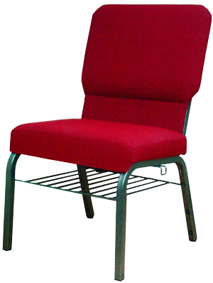
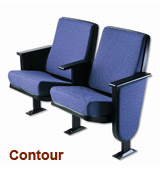
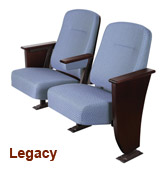
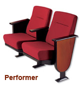

	

<!--END COL-LEFT-->
    

    	<h1>Chairs</h1>
        
        
        <h2>Sanctuary Chairs</h2>
        
 Our line of comfortable inter-locking sanctuary chairs are constructed with 1" high carbon steel. This 1" 18-gauge frame is both seat and back. Our sanctuary chairs come with a standard 21" wide seat. Our manufacturer offers a lifetime warranty on the framing system and covers the entire chair with the exception of the fabric and foam. Most fabrics carry a 10 year warranty as does the foam. Our heat-generated powder-coat finishes are durable and our fabrics come in a variety of colors. We never use particle board or composite materials in our seats or backs. Our under-seat book racks are accessible from the front and the rear. Our large selection of chair options gives us the ability to meet most interior styling and do so in budget. This is an inter-locking chair that is used as sanctuary seating in many new sanctuaries.

        
        
        <h2>Auditorium &amp; Theatre Seating</h2>
        
We offer a durable and comfortable line of American-made theater and auditorium style seating as well for churches or schools looking for a more contemporary style of chair. More important is the durable construction of each mechanism. Our heavy-gauge steel handles the ups and downs of excessive use. Our automatic self-rising, gravity-lift seat adds to the superior performance. We offer a wide array of fabrics that are also durable and long lasting. We offer many options to fit the requirements of your facility. We also offer tables and chairs for your fellowship hall and a full line of classroom furniture for children and adults.

        
<b>Please click an image below to see a larger version.</b>

        

        
        
        
         
        

        
        
Please <a href="contact-us.html#request-catalog">click here</a> to jump to the "Request a Catalog" Form on our contact page, or call us directly to make the request.

    
<!--END COL-RIGHT-->
     

<!--END CONTENT-->