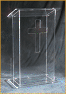
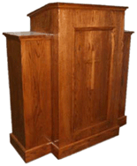
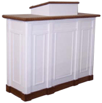
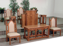
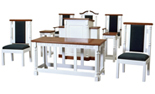
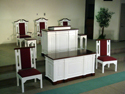
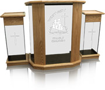
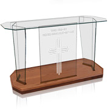
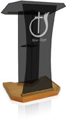
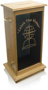

	

<!--END COL-LEFT-->
	

		<h1>Chancel Furniture</h1>
	    
	    <h2>Acrylic</h2>
	    
Break from the traditional with our sleek, contemporary styles or with a classic look that incoporates a combination of acrylic, wood and brass.

	    
	    
	    <h2>Wood</h2>
	    
The architecture of our solid oak furniture is beautifully reflected in several designs and can be custom crafted to fit the decor of your sanctuary.

	    
	    <h2>Colonial (white)</h2>
	    
Our colonial series furniture reflects the rigid standards of colonial architecture. Options include raised panel design or applied face moldings.

	    <h2>Full Sets (click to see larger version):</h2>
	    

	    
	    
	    
	     
	    

	     

	    <h1>Sample Prestige Glass Products:</h1>

	    
	    <h2>Rhema Pulpit</h2>
	    
The ultimate in versatility, combining the contemporary appeal of glass with the warm tradition of wood accents. The wings of the Rhema are detachable, allowing your worship leader to customize the podium set-up for any occasion.

	    
	    <h2 class="left">Elegance Communion Table</h2>
	    
Available in three standard lengths (40”, 48” and 60”), our Elegance Communion Table is the perfect complement to your pulpit. Includes your logo or favorite artwork and communion scripture reference etched into the front panel.

	    
	    <h2>Glass Speaker Lectern</h2>
	    
Designed as an accent piece for your platform or as a secondary furnishing, the Speaker is expertly crafted, light, portable and durable. Available with or without recessed castors, it fits anywhere.

	    
	    
	    <h2>Standing Offering Box</h2>
	    
Introducing our Floor Model Style Offering Box in glass and oak with handles and key-locking side panel. Features a custom etched front panel in clear or tinted glass and a choice of 8 wood stains.

	    
Please <a href="contact-us.html#request-catalog">click here</a> to jump to the "Request a Catalog" Form on our contact page, or call us directly to make the request.

	
<!--END COL-RIGHT-->
	 
	
<!--END CONTENT-->