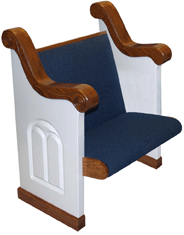
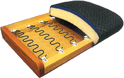
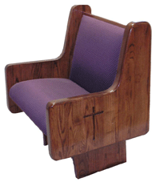

	

		

	    	<h3>Stained Wood</h3>
	        <ul>
	        	<li><a class="fancybox" rel="pew-examples" href="images/pews/cantilevered-pew-examples.jpg" title="Cantilevered Pews">Cantilevered Pews</a></li>
	            <li><a class="fancybox" rel="pew-examples" href="images/pews/traditional-pew-examples.jpg" title="Traditional Pews">Traditional Pews</a></li>
	        </ul>
	         
	        <h3>Painted Wood</h3>
	        <ul>
	        	<li><a class="fancybox" rel="pew-examples" href="images/pews/colonial-pew-examples.jpg" title="Colonial Pews">Colonial Pews</a></li>
	        </ul>
	    
<!--END LEFT-NAV-->
	
<!--END COL-LEFT-->
	

		<h1>Pews</h1>
	    
Our pew manufacturer is Kivett's Inc., a Christian owned and managed company with exceptional financial strength and stability. Their facilities feature the latest state-of-the-art equipment with talented wood working craftsmen that take pride in their finished product. This fact gives assurance of their longevity and their position as an industry premier manufacturer of church furniture. Because they know their quality is unequaled, they offer a lifetime structural warranty as a promise of construction excellence. Others offer a limited 25-year warranty or less. A visit to several pew manufacturers will shock your expectations! Ours will confirm our professional standards.

	    
Our standard pew seats and backs are constructed using eleven-ply, solid core “cabinet" grade plywood. We are the only company to my knowledge that uses cabinet grade plywood, not construction grade. That simply means the wood has no voids. Our ends are solid 2" northern red oak. We use no soft pine, no particleboard, no veneers and no southern grown woods. Southern woods have higher moisture content, even after drying.

	    
We offer three seat options. The first and best selling is our “Lazy-Boy" style serpentine spring seat. Our springs are five inches apart, tied together and held in place by self-lubricating nylon clips. They remain quiet and offer more comfort and support. Because the spring is installed under tension, it is hard for fabrics to wrinkle. We also offer a 3" or 4" Reflex Polyurethane foam seat that has no fillers.

	    
Our fabrics have Teflon interwoven stain resistors with acrylic backing for additional strength and durability. Our special backing helps to prevent fabric wrinkling as well. We also offer a wide selection of standard pew ends, or our custom shop can create a special design just for you.

	    
	    
Our seat backs are 35 ½" high, a full 2 ½" inches higher than our competition. Our backs come with several options as well. We offer the options of a 1 ½" back support or a lumbar back. Our lumbar is standard! We secure our ends to the floor with two bolts each one being ½" in size. Others use only one 3/8" bolt. Our standard supports are 1 ½"oak and are tapered designed to maximize room for the feet. You will need to see our stain finishes to appreciate the fact that we hand rub our stains to insure the stain has penetrated the wood grains. We apply two coats of sealer and two coats of high solid pre-catalyzed lacquer for an extremely durable finish. Our sheens are breath taking. All this and our pricing are normally less than others.

	    
We also offer many standard pew ends. In addition to the traditional solid oak ends, our custom shop can create other styling options to meet the needs of contemporary sanctuaries and chapels.

	    
Please <a href="contact-us.html#request-catalog">click here</a> to jump to the "Request a Catalog" Form on our contact page, or call us directly to make the request.

	
<!--END COL-RIGHT-->
	 
	
<!--END CONTENT-->